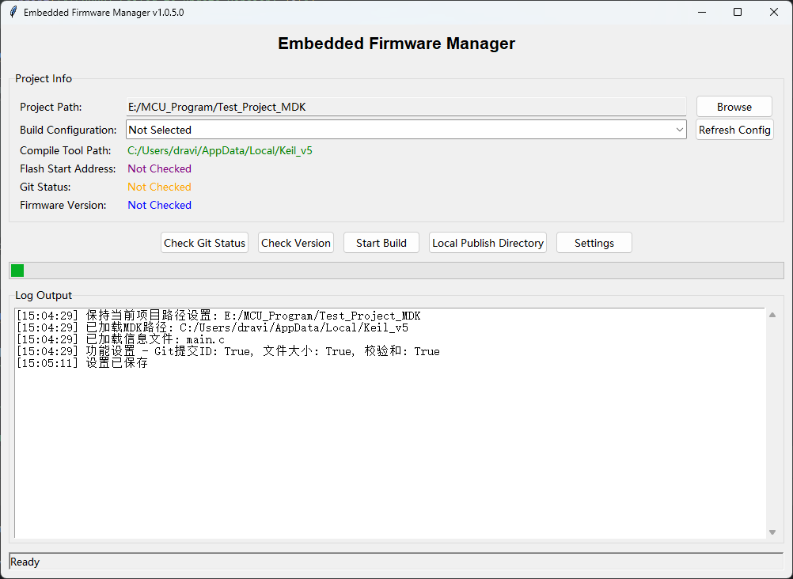
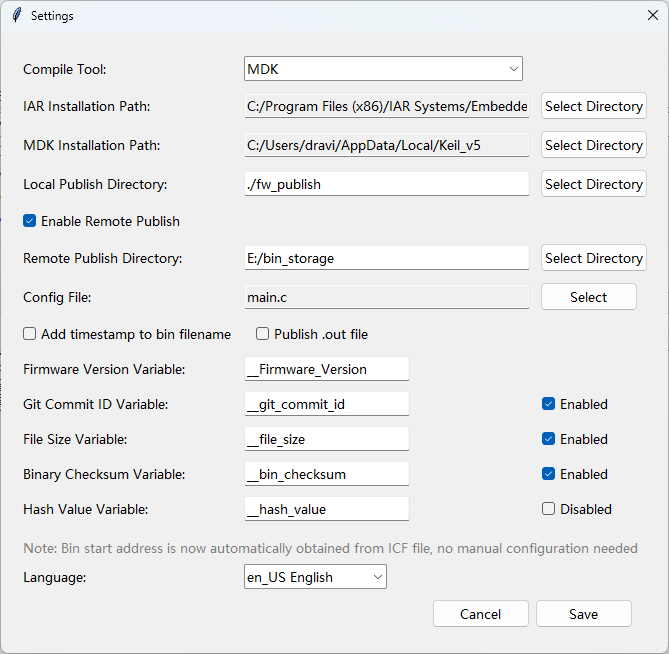
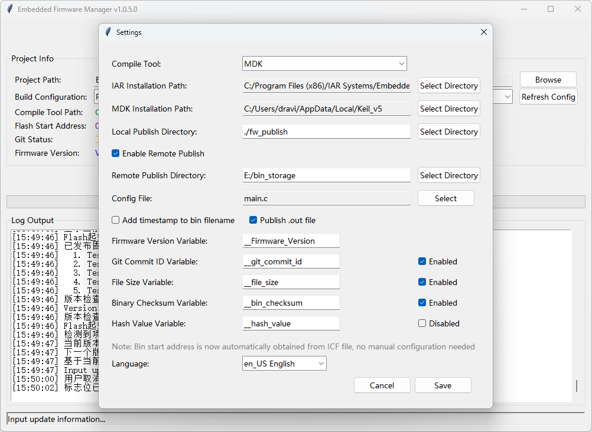
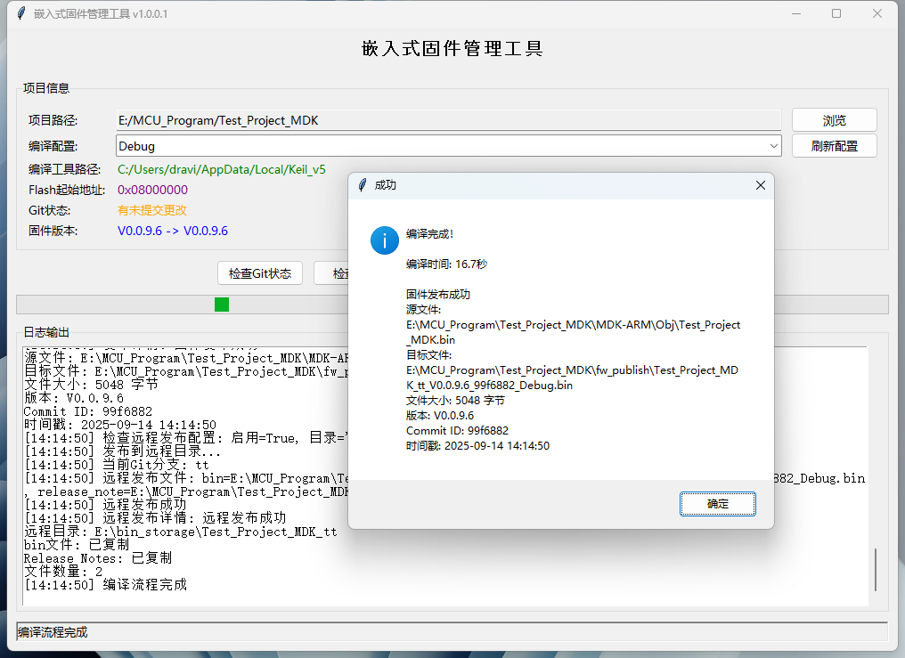
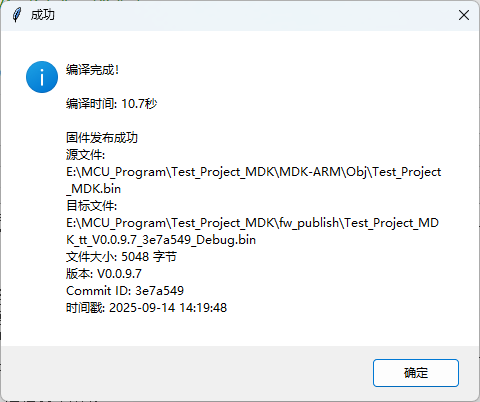
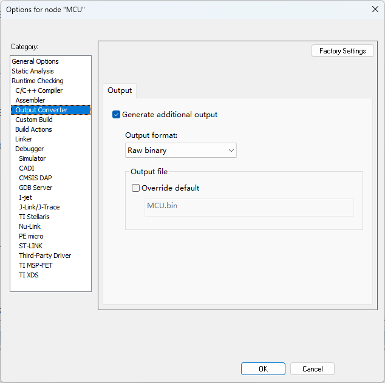
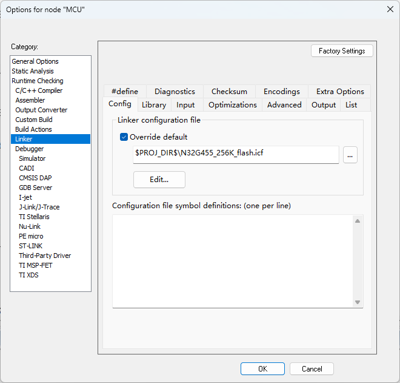
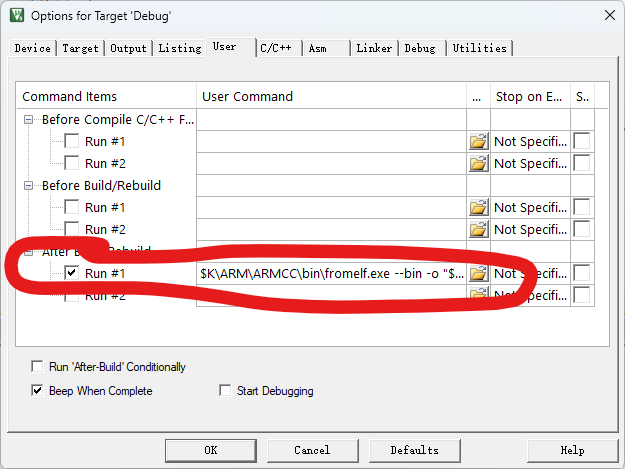
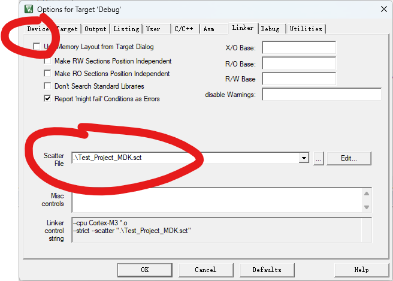

# 嵌入式固件管理工具 / Embedded Firmware Manager

[](https://python.org)
[](docs/LICENSE.md)
[](https://www.microsoft.com/windows)
[](https://www.iar.com/iar-embedded-workbench/)
[](https://www.keil.com/)

一个支持多种嵌入式开发工具链的固件管理工具，支持IAR和MDK项目编译、版本管理、Git集成和二进制文件修改。

A firmware management tool supporting multiple embedded development toolchains, including IAR and MDK project compilation, version management, Git integration, and binary file modification.


### 主要功能 / Main Features

#### 中文功能说明

- 📦 **版本管理** - 版本号管理，自动递增/手动设置版本号
- 🔄 **Git集成** - 自动提交版本更改，获取commit信息，支持自定义提交信息
- 🔧 **多工具链支持** - 支持IAR Embedded Workbench和MDK (Keil uVision)项目编译
- 🛠️ **二进制修改** - 自动修改bin文件内容，在指定地址注入File Size、CRC、Hash和Git Commit信息
- 📝 **发布说明** - 自动生成和管理Release Notes
- 📁 **文件管理** - 自动重命名、复制和发布固件文件，支持本地和远程发布
- 🚀 **一键执行** - 全流程自动化，从Git检查到文件发布
- 🌐 **多语言支持** - 支持中文、繁体中文、英文界面

#### English Features

- 📦 **Version Management** - Version number management, automatically increment/manually set version numbers
- 🔄 **Git Integration** - Automatically commit version changes, retrieve commit information, support custom commit messages
- 🔧 **Multi-toolchain Support** - Supports IAR Embedded Workbench and MDK (Keil uVision) project compilation
- 🛠️ **Binary Modification** - Automatically modify bin file content, inject File Size, CRC, Hash and Git Commit information at specified addresses
- 📝 **Release Notes** - Automatically generate and manage Release Notes
- 📁 **File Management** - Automatically rename, copy and publish firmware files, supports local and remote publishing
- 🚀 **One-Click Execution** - Full workflow automation from Git check to file publishing
- 🌐 **Multi-Language Support** - Supports Chinese, Traditional Chinese, and English interfaces

## 界面预览 / Interface Preview

### 工具演示 / Tool Demo


### 主界面 / Main Interface


### 设置界面 / Settings Interface



### 编译过程 / Compilation Process


### 提交信息 / Commit Information


### 完成界面 / Finish Interface



### 发布说明 / Release Notes


### 二进制文件修改 / Binary File Modification


## 重要说明 / Important Notes

### Hash功能状态 / Hash Function Status
hash功能尚未实现

### IAR/MDK配置要求 / IAR/MDK Configuration Requirements

IAR/MDK需要设置输出bin文件，使用本地的icf/sct文件

$K\ARM\ARMCC\bin\fromelf.exe --bin -o "$L@L.bin" "$L@L.axf"

#### IAR配置示例 / IAR Configuration Example



#### MDK配置示例 / MDK Configuration Example



## 快速开始 / Quick Start

### 安装和运行 / Installation and Running

1. **克隆仓库** / **Clone repository**：
```bash
git clone https://github.com/yourusername/iar-firmware-publish-tool.git
cd iar-firmware-publish-tool
```

2. **安装依赖** / **Install dependencies**：
```bash
pip install -r requirements.txt
```

3. **运行程序** / **Run the program**：
```bash
python main.py
```


## 文档 / Documentation

- 📖 [功能概览](./docs/OVERVIEW.md) - 完整的功能说明和界面展示
- 🚀 [快速开始指南](./docs/QUICKSTART.md) - 5分钟快速上手
- 👤 [用户指南](./docs/USER_GUIDE.md) - 详细的使用说明和最佳实践
- 📋 [更新日志](./docs/CHANGELOG.md) - 版本更新历史

## 系统要求 / System Requirements

- Windows 10/11
- Python 3.7+
- IAR Embedded Workbench 8.x 或 MDK (Keil uVision) 5.x
- Git

## 许可证 / License

本项目采用 MIT 许可证 - 查看 [LICENSE](./docs/LICENSE.md) 文件了解详情。

This project is licensed under the MIT License - see the [LICENSE](./docs/LICENSE.md) file for details.

## 联系方式 / Contact

如有问题，请提交Issue或联系开发者。

If you have any questions, please submit an Issue or contact the developer.
